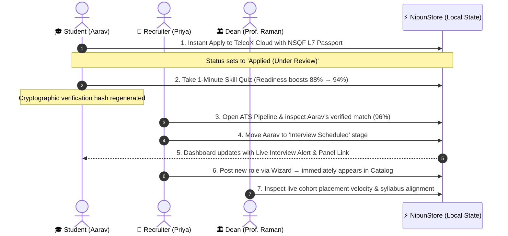

# 🏛️ NIPUN — National Industry Placement & Upskilling Network

> **Digital Public Workforce Infrastructure Prototype**  
> Bridging higher education curricula with enterprise hiring through cryptographically validated, competency-mapped skill passports (NSQF Levels 4–8).

[](https://nipun-mvp.vercel.app/)
[](https://nipun-mvp.vercel.app/competition-guide)
[](https://nipun-mvp.vercel.app/design-system)

---

## 🌐 Live Prototype & Pitch Launchpad

* **Live Hosted URL:** [https://nipun-mvp.vercel.app/](https://nipun-mvp.vercel.app/)
* **Competition Pitch Guide:** [https://nipun-mvp.vercel.app/competition-guide](https://nipun-mvp.vercel.app/competition-guide)
* **Main Ecosystem Portal:** [https://nipun-mvp.vercel.app/index](https://nipun-mvp.vercel.app/index)

---

## 💡 The Problem & The NIPUN Solution

* **The Problem:** 
  * Over **60%** of higher education graduates lack verified alignment with real-world enterprise tech stacks.
  * Paper/PDF resumes are plagued by unverified claims, forcing recruiters to waste months on speculative vetting.
  * Universities lack real-time visibility into whether their curriculum aligns with Fortune 500 GCC hiring needs.
* **The Solution:** 
  * **NIPUN** establishes an authoritative, federated digital public infrastructure.
  * Students earn **NSQF-mapped cryptographically verified passports** based on live capstones and proctored micro-benchmarks.
  * Recruiters filter candidates by verified competencies and issue instant interview calls and offers.
  * Universities monitor cohort placement velocity and curricular parity in real time.

---

## 🎭 3 Playable Demo Personas

The prototype includes a **persistent presentation control banner** at the top of every screen to switch personas instantly:

| Persona | Name & Role | Key Responsibilities & Capabilities |
| :--- | :--- | :--- |
| 🎓 **Student** | **Aarav Sharma**<br/>`Final Year B.Tech CSE, IIT Delhi` | • 1-Click **Instant Apply** with cryptographic skill passport (`#8f92..c1a`).<br/>• Complete proctored **Skill Benchmark** (boosts score from 88% → 94%).<br/>• Receive **real-time interview invites & offer letters** on his dashboard. |
| 🏢 **Enterprise Recruiter** | **Priya Nair**<br/>`Head of Campus Talent, Tata Digital / TelcoX` | • Evaluate candidates via high-density **ATS Pipeline** with 90%+ match scoring.<br/>• Advance candidate stages: `Applied` → `Shortlisted` → `Interview` → `Offer`.<br/>• **Publish new roles** with immediate catalog propagation. |
| 🏛️ **University Leader** | **Prof. K. Raman**<br/>`Dean of Placements, IIT Delhi` | • Monitor real-time **Placement Velocity (78.4%)** & average CTC (₹18.2 LPA).<br/>• Track **Curricular Parity (94.8%)** against live Fortune 500 GCC tech stacks.<br/>• Inspect **2,400+ federated institutional nodes** across India. |

---

## ⚡ 3-Minute Competition Demo Script

Follow this step-by-step presentation script to demonstrate the prototype to judges:



1. **Step 1 — Student Application & Skill Verification:**
   * Open [Student Dashboard](https://nipun-mvp.vercel.app/student-dashboard) (88% Readiness).
   * In top banner, click **⚡ Live Flow Actions → Take Skill Benchmark** (boosts score to 94%).
   * Navigate to [Opportunities Catalog](https://nipun-mvp.vercel.app/opportunities) and click **Instant Apply** on *TelcoX Cloud Infrastructure*.
2. **Step 2 — Recruiter Review & Stage Advance:**
   * In top banner, click **🏢 Employer (Priya)**.
   * Open [Applicant Pipeline](https://nipun-mvp.vercel.app/applicant-pipeline).
   * Notice Aarav's application at the top. Change his dropdown stage to **Interview**.
3. **Step 3 — Instant Cross-Role Notification:**
   * Switch back to **🎓 Student (Aarav)**.
   * Observe the live blue banner on [Student Dashboard](https://nipun-mvp.vercel.app/student-dashboard): *"🚀 Direct Technical Interview Scheduled with TelcoX Cloud for Tomorrow 11:30 AM"*.
   * Click [Student Portfolio](https://nipun-mvp.vercel.app/student-portfolio) to audit the cryptographic proof hash.
4. **Step 4 — University Governance:**
   * Switch to **🏛️ University (Prof. Raman)**.
   * Open [Institution Analytics](https://nipun-mvp.vercel.app/institution-analytics) to view real-time placement velocity and consortium nodes.

---

## 🗺️ Screen Catalog & Live Routes

| Screen | Route | Description |
| :--- | :--- | :--- |
| 📋 **Pitch Launchpad** | [`/competition-guide`](https://nipun-mvp.vercel.app/competition-guide) | Presentation dashboard with elevator pitch, script, and persona cards |
| 🏛️ **Main Landing Page** | [`/index`](https://nipun-mvp.vercel.app/index) | Apex institutional homepage, NSQF framework tiers, trust badges |
| 🎓 **Student Dashboard** | [`/student-dashboard`](https://nipun-mvp.vercel.app/student-dashboard) | Readiness score, live interview alerts, curricular alignment radar |
| 💼 **Opportunities Catalog** | [`/opportunities`](https://nipun-mvp.vercel.app/opportunities) | Filterable directory with 1-click apply and dynamic posting injection |
| 📋 **Applicant Pipeline (ATS)**| [`/applicant-pipeline`](https://nipun-mvp.vercel.app/applicant-pipeline) | Recruiter candidate evaluation ledger with live stage status dropdowns |
| ✍️ **Post Opportunity** | [`/post-opportunity`](https://nipun-mvp.vercel.app/post-opportunity) | Employer job posting wizard with immediate catalog publishing |
| 📜 **Student Portfolio** | [`/student-portfolio`](https://nipun-mvp.vercel.app/student-portfolio) | Verified student dossier with cryptographic ledger integrity audit |
| 📊 **Institution Analytics** | [`/institution-analytics`](https://nipun-mvp.vercel.app/institution-analytics) | Placement velocity metrics, departmental tracking, salary differentials |
| 🌐 **Node Directory** | [`/node-directory`](https://nipun-mvp.vercel.app/node-directory) | National institutional registry of 2,400+ federated university nodes |
| 🎨 **Design System Spec** | [`/design-system`](https://nipun-mvp.vercel.app/design-system) | Interactive token guide (colors, typography, grid, elevation) |
| 📱 **Mobile Preview** | [`/mobile-preview`](https://nipun-mvp.vercel.app/mobile-preview) | Responsive mobile viewport optimization |

---

## 🎨 Design System & Visual Tokens

The user interface follows the official **Modern Institutional Corporate** design standard documented in [`DESIGN_SYSTEM.md`](./DESIGN_SYSTEM.md):

* **Primary Brand**: `#123C69` (Deep Blue — Sovereign Authority)
* **Secondary**: `#0E7490` (Modern Teal — Technical Innovation)
* **Accent**: `#F59E0B` (Bright Amber — Urgent Opportunity)
* **Verified / Success**: `#16A34A` (Verified Green — Validated Attainment)
* **Canvas / Background**: `#F8F9FF` (Ice Blue — Eye Fatigue Reduction)
* **Surface**: `#FFFFFF` (Elevated Cards with 1px structural framing)
* **Typography**: **Plus Jakarta Sans** (Displays/Headers) paired with **Inter** (Dense Data/Body)

---

## 💻 Local Development Setup

Clone the repository and run locally in any browser with zero dependencies:

```bash
# 1. Clone repository
git clone https://github.com/<your-username>/<repo-name>.git
cd <repo-name>

# 2. Run local server (Python 3)
python -m http.server 3000

# 3. Open browser
# Visit http://localhost:3000/competition-guide.html
```

---

## 🏗️ Architecture & Technology Stack

* **Frontend**: Vanilla HTML5, Modern ES6+ JavaScript, Tailwind CSS (CDN runtime).
* **Typography & Icons**: Google Fonts (*Plus Jakarta Sans*, *Inter*) & Google Material Symbols.
* **State Management**: Reactive Client-Side Event Store (`localStorage` persistence in [`assets/demo-store.js`](./assets/demo-store.js)).
* **Design Origin**: Screen architectures exported and adapted from Google Stitch (`projects/15141067284103482666`).
* **Deployment**: [Vercel](https://vercel.com/) with Clean URLs enabled via [`vercel.json`](./vercel.json).

---

## 📄 License & Attribution

Built for competition demonstration. Exported and developed under the **NIPUN Digital Public Infrastructure** initiative.
